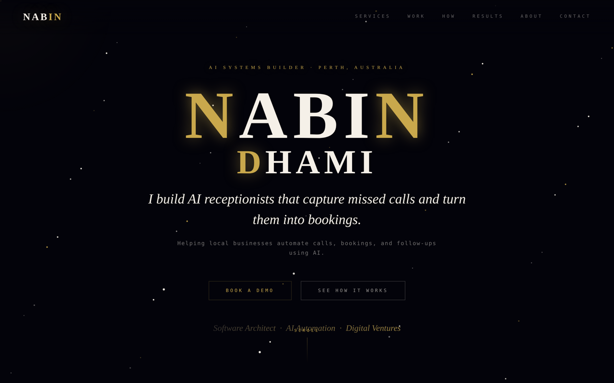

# Nabin Dhami — portfolio

My personal site: I build AI receptionists and automation systems that help local businesses
capture missed calls, book appointments and follow up automatically.



## Who it's for

Owners of small, local service businesses (cleaners, trades, clinics, salons) in Perth and beyond
who are losing bookings to missed calls and slow replies, plus anyone reviewing my work.

## What's on it

- **Services:** AI receptionist systems, n8n automation workflows, websites & lead systems, AI content
- **Work:** AI Receptionist demo, Perth Shine Crew, [TooFan](https://github.com/dhaminabin12-pixel/toofan-platform)
- **How it works:** Analyse → Build → Connect → Automate
- **Contact:** one-click email that works inside in-app browsers like Messenger

## Stack

React 18 + Vite. One self-contained `App.jsx` with inline styles and no UI library, so it stays fast and has
almost no dependencies.

## A decision I made, and why

**Contact Me opens Gmail compose with `window.open()` instead of a `mailto:` link.**
Most visitors arrive from links shared in Messenger and Instagram, and their in-app browsers often
ignore `mailto:` because no mail app is registered, so the button did nothing. Opening Gmail's web compose
in a new window works in those browsers, and on desktop it's still a single click.

## Run it

```bash
npm install
npm run dev      # http://localhost:5173
npm run build
```
